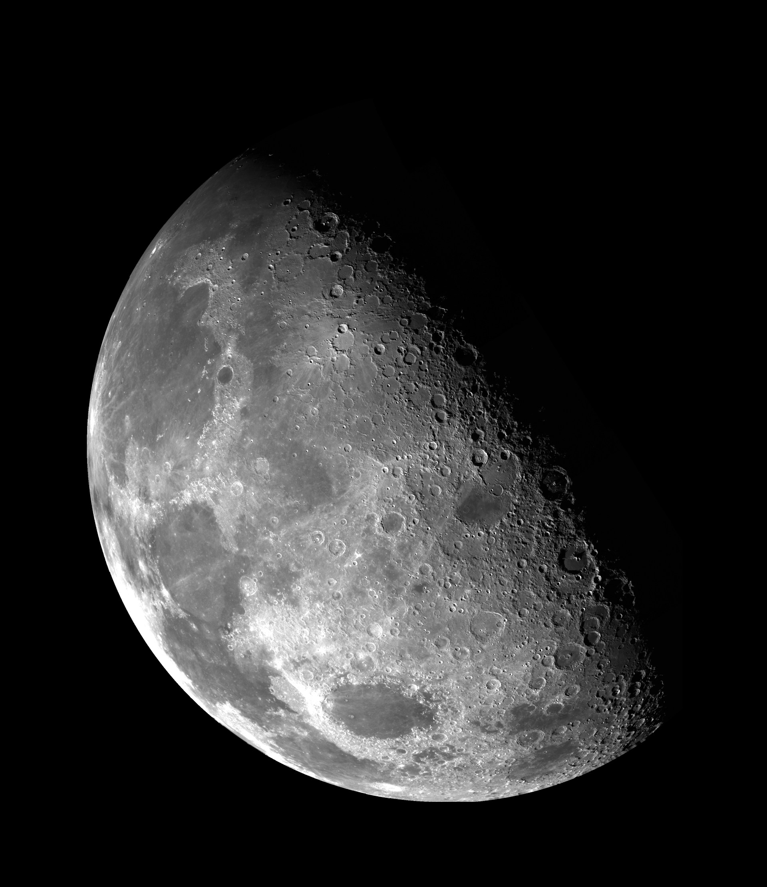
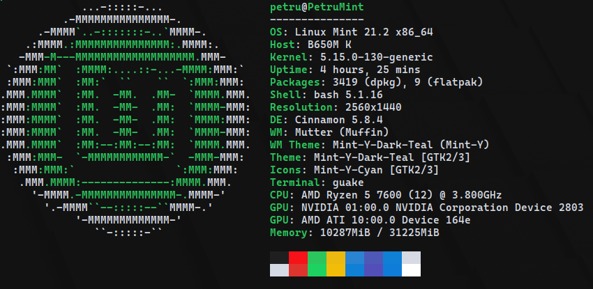
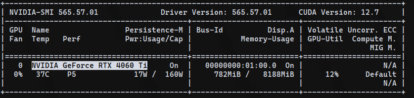

# Salt and Pepper Noise Filtering Using CUDA

#### Author: Petru Micu
#### Master's Program: ACES
#### Github: https://github.com/PetruMicu/Salt_and_Pepper_Noise_CUDA

## Table of Contents
- [Introduction](#introduction)
- [Theoretical Approach](#theoretical-approach)
    - [Median Filtering](#median-filtering)
    - [CUDA Programming Model](#cuda-programming-model)
        - [Kernel](#kernel)
        - [Blocks and Threads](#blocks-and-threads)
        - [Shared Memory](#shared-memory)
        - [Advantages of Using CUDA](#advantages-of-using-cuda)
    - [OpenCV (Open Source Computer Vision Library)](#opencv-open-source-computer-vision-library-)
- [Implementation](#implementation)
- [Hardware](#hardware)
- [Performance](#performance)
- [Conclusion](#conclusion)

---

## Introduction

Salt and pepper noise is a common type of noise that affects images, manifesting as randomly scattered white and black 
pixels. Removing such noise effectively without losing image details is a crucial problem in image processing. In this 
project, I implement a CUDA-based solution to apply median filtering to remove salt and pepper noise from images.

This approach uses the GPU for parallel processing, accelerating the filtering process and making it suitable for real-time 
applications. The filter is applied using CUDA kernels, which leverage the GPU's parallel architecture to process multiple 
pixels simultaneously.

To create the test images, I used a Python script called generate_noisy_image. This script generates images with salt 
and pepper noise by randomly altering pixel values to simulate the effect of noise. It allows easy experimentation with 
different noise levels, providing a controlled way to evaluate the performance of noise-removal algorithms, like the one 
presented in this project.

### Original Image


### Noisy Image


### Filtered Image


---

## Theoretical Approach

### Median Filtering

Median filtering is a nonlinear filter used primarily for noise reduction. For each pixel in the image, the filter considers a neighborhood of surrounding pixels, sorts them, and replaces the pixel's value with the median value of the sorted pixels. This process effectively removes salt and pepper noise without blurring edges, as the median preserves sharp transitions.

The core idea is:
1. For each pixel, gather a neighborhood of pixels (usually a 3x3 window).
2. Sort the pixel values within the neighborhood.
3. Replace the current pixel with the median value.


Median filtering can be parallelized, and it is actually a great candidate for parallel processing, 
especially when dealing with large images.

### CUDA Programming Model

CUDA (Compute Unified Device Architecture) is a parallel computing platform developed by NVIDIA that allows the use of 
GPUs for general-purpose computing. It provides a powerful framework for executing computations on the GPU, which is 
optimized for parallelism. In this project, the goal is to exploit the parallelism of the GPU to apply the median filter 
in parallel on each pixel of the image.

#### Key Components of the CUDA Model

CUDA programs are organized around a few key concepts that work together to enable efficient parallel computing. 
Below are the key components used in the implementation of the median filter on the GPU:

#### Kernel

A **kernel** is a function that is executed on the GPU. It contains the instructions that each thread will execute. 
In the case of image processing, the kernel processes one pixel at a time, applying the filter algorithm. When the 
kernel is launched, each thread will work on a single pixel and process the data in parallel across the image.

- **Kernel Execution**: The kernel is executed by a large number of threads simultaneously.
- **Thread Indexing**: Each thread is responsible for processing one pixel, identified by its thread index.

#### Blocks and Threads

The CUDA programming model organizes threads into a grid of blocks. Each block contains multiple threads, and the 
threads within a block can communicate with each other via shared memory.

- **Blocks**: A block is a group of threads that execute the same kernel. Blocks can be organized in one, two, or 
three-dimensional structures.
- **Threads**: Threads within a block are executed simultaneously. Each thread processes a separate piece of data—in 
this case, a single pixel of the image.

In the context of image processing:
- Each **thread** applies the median filter to one pixel of the image.
- The **block** contains multiple threads, allowing the image to be divided into manageable chunks for parallel processing.

#### Shared Memory

**Shared memory** is a small, fast memory space that is shared among threads within the same block. It is much faster 
than global memory, and it is used to store temporary data that is accessed frequently by threads. In the case of the 
median filter, shared memory stores the neighborhood of pixels around the pixel being processed.

- **Usage in Median Filter**: Threads in a block load their pixel's neighbors into shared memory. Once the data is 
loaded, each thread can calculate the median by accessing the shared memory, ensuring faster access than reading 
from global memory.
- **Optimization**: By using shared memory, the number of slow global memory accesses is minimized, which significantly
improves performance.

#### Advantages of Using CUDA

- **Parallelism**: CUDA enables fine-grained parallelism, allowing thousands of threads to process the image in parallel, 
greatly speeding up the computation compared to serial CPU processing.
- **Efficiency**: Shared memory optimizations reduce memory latency, and the use of high-throughput GPU cores accelerates computation.
- **Scalability**: CUDA allows the program to scale with the number of available cores on the GPU, making it suitable for 
handling large datasets like high-resolution images.

Key components of the CUDA model used:
- **Kernel**: A function that is executed on the GPU.
- **Blocks and Threads**: The kernel is executed by many threads organized in blocks, where each thread processes one pixel of the image.
- **Shared Memory**: A fast memory shared by threads within the same block, used here to store the pixel neighborhood for median calculation.

### OpenCV (Open Source Computer Vision Library) 

It is a popular open-source library used for real-time image processing and computer vision. It supports a wide range 
of tasks such as image filtering, object detection, and video processing, with efficient GPU acceleration support via CUDA.

Key Features:

- **Image Processing**: Functions for tasks like filtering, resizing, and edge detection.
- **Computer Vision**: Algorithms for object detection, face recognition, and tracking.
- **GPU Support**: CUDA integration for accelerated processing.

Usage in This Project:

- **Image Loading**: OpenCV's `imread()` is used to load images and `imwrite()` to save the output.
- **Image Conversion**: Converts images from BGR to RGBA format for compatibility with CUDA kernels.
- **GPU Integration**: Uses `cuda::GpuMat` for transferring image data to the GPU.
- **Displaying Results**: Displays images with `imshow()` for visual comparison.

OpenCV simplifies tasks like image loading, conversion, and display, while CUDA handles the parallelized filtering process, 
making it a powerful combination for image processing tasks.

---

## Implementation

The implementation consists of two main parts:
1. **CUDA Kernel for Median Filter**: This kernel is responsible for applying the median filter to each pixel using shared memory to store the neighborhood.
2. **Host Code**: This code manages image loading, conversion, and interaction with the GPU.

### Code Explanation

```cpp
#include <iostream>
#include <opencv2/opencv.hpp>
#include <opencv2/core/cuda.hpp>

using namespace std;
using namespace cv;

// CUDA device function for swapping two values
__device__ void swap(unsigned char &a, unsigned char &b) {
    unsigned char temp = a;
    a = b;
    b = temp;
}
```
`swap` function: A utility function for swapping two values. It is used within the kernel to sort the RGB pixel values (i.e., to find the median).

```cpp
// CUDA Kernel for Median Filtering
__global__ void applyMedianFilter(const uchar4* src, uchar4* dst, int width, int height) {
int x = blockIdx.x * blockDim.x + threadIdx.x;
int y = blockIdx.y * blockDim.y + threadIdx.y;

// Check if pixel coordinates are within the image bounds
if (x < width && y < height) {
    // Shared memory for the neighborhood window
    __shared__ uchar4 shared_mem[16 + 2][16 + 2];
    
    // Thread's local coordinates within the block
    int lx = threadIdx.x + 1;
    int ly = threadIdx.y + 1;
    
    // Copy the pixel at (x, y) to shared memory
    shared_mem[ly][lx] = src[y * width + x];
```
Kernel function: `applyMedianFilter` is the CUDA kernel that applies the median filter to an image.
The function is launched in parallel by threads.
Each thread processes one pixel, using the block and thread indices to identify the pixel it is responsible for.

Shared memory: `shared_mem` is used to store the neighborhood of pixels around the current pixel. 
This helps avoid accessing global memory repeatedly, which is slower.
```cpp
        // Load halo pixels (boundary pixels)
        if (threadIdx.x < 1 && x > 0) {
            shared_mem[ly][lx - 1] = src[y * width + x - 1];
        }
        if (threadIdx.x >= blockDim.x - 1 && x < width - 1) {
            shared_mem[ly][lx + 1] = src[y * width + x + 1];
        }
        if (threadIdx.y < 1 && y > 0) {
            shared_mem[ly - 1][lx] = src[(y - 1) * width + x];
        }
        if (threadIdx.y >= blockDim.y - 1 && y < height - 1) {
            shared_mem[ly + 1][lx] = src[(y + 1) * width + x];
        }

        __syncthreads();
```
Loading halo pixels: In CUDA, each block processes a subset of the image, and its threads only have access to 
the data in their local region. However, a pixel's neighbors may lie outside the block. We load boundary pixels 
(halo pixels) into shared memory to ensure the neighborhood is correctly populated for all pixels.

`__syncthreads()`: This function synchronizes all threads in the block to ensure that shared memory is fully loaded 
before any thread accesses it.
```cpp
        // Apply median filter within the shared memory window
        if (lx > 0 && lx < blockDim.x + 1 && ly > 0 && ly < blockDim.y + 1) {
            uchar windowR[9], windowG[9], windowB[9];
            int k = 0;

            // Populate the RGB arrays from the shared memory
            for (int i = -1; i <= 1; i++) {
                for (int j = -1; j <= 1; j++) {
                    uchar4 pixel = shared_mem[ly + i][lx + j];
                    windowB[k] = pixel.x;
                    windowG[k] = pixel.y;
                    windowR[k] = pixel.z;
                    k++;
                }
            }
```
RGB arrays: For each pixel, the kernel gathers the neighboring pixels from the shared memory into separate arrays 
(windowR, windowG, and windowB) for the red, green, and blue channels, respectively.
```cpp
            // Sort the RGB arrays to find the median values
            for (int i = 0; i < 9; i++) {
                for (int j = i + 1; j < 9; j++) {
                    if (windowB[i] > windowB[j]) swap(windowB[i], windowB[j]);
                    if (windowG[i] > windowG[j]) swap(windowG[i], windowG[j]);
                    if (windowR[i] > windowR[j]) swap(windowR[i], windowR[j]);
                }
            }

            // Assign the median values to the output image
            dst[y * width + x] = make_uchar4(windowB[4], windowG[4], windowR[4], 255); // Median
        }
    }
}
```
Sorting and assigning the median: The `windowB`, `windowG`, and `windowR` arrays contain 9 values each (for a 3x3 neighborhood). 
These arrays are sorted, and the median value (located at index 4) is used to replace the original pixel.
```cpp
int main() {
    // Load image
    Mat image = imread("../test_image.jpg");
    if (image.empty()) {
        cout << "Could not open or find the image" << endl;
        return -1;
    }

    // Convert to RGBA (4 channels)
    Mat imageRGBA;
    cvtColor(image, imageRGBA, COLOR_BGR2RGBA);
```
Loading the image: The image is read using OpenCV's `imread` function, and it is converted from BGR to RGBA format 
(4 channels) to ensure compatibility with the CUDA kernel.
```cpp
    // Upload image to GPU
    cuda::GpuMat d_src(imageRGBA);
    cuda::GpuMat d_dst(imageRGBA.size(), imageRGBA.type());
```
Transferring data to the GPU: The image is uploaded to the GPU using cuda::GpuMat, which is an OpenCV data structure 
optimized for GPU processing.
```cpp
    // Define grid and block dimensions
    const int blockSize = 16;
    dim3 block(blockSize, blockSize);
    dim3 grid((d_src.cols + block.x - 1) / block.x, (d_src.rows + block.y - 1) / block.y);
```
Grid and block dimensions: The image is divided into a grid of blocks, with each block consisting of threads that process 
individual pixels. The block size is set to 16x16, which is a typical size for CUDA image processing tasks.
```cpp
    // Launch kernel
    applyMedianFilter<<<grid, block>>>(d_src.ptr<uchar4>(), d_dst.ptr<uchar4>(), d_src.cols, d_src.rows);
    cudaDeviceSynchronize();
```
Kernel launch: The `applyMedianFilter` kernel is launched on the GPU with the defined grid and block dimensions. 
`cudaDeviceSynchronize` ensures that the kernel has finished execution before continuing.
```cpp
    // Download result from GPU
    Mat filteredImage;
    d_dst.download(filteredImage);
    
    // Convert back to BGR for display
    cvtColor(filteredImage, filteredImage, COLOR_RGBA2BGR);
```
Downloading the result: After the kernel execution, the filtered image is downloaded back to the host memory from the 
GPU, and it is converted back to the BGR color space for display.
```cpp
    // Display images
    imshow("Original Image", image);
    imshow("Filtered Image", filteredImage);
    waitKey(0);

    return 0;
}
```

Displaying the results: The original and filtered images are displayed using OpenCV's `imshow` function.

---

## Hardware


---

## Performance

To evaluate the performance of the CUDA-based filtering approach, I compare the execution time of the median filter on 
the CPU and the GPU. The performance improvements achieved by CUDA are primarily due to parallelization of the filtering 
process, which allows simultaneous processing of multiple pixels. The GPU's parallel architecture greatly 
accelerates the filtering for large images compared to the sequential CPU approach.

Execution Time Comparison:
Speedup = CPU Time / GPU Time

Given the times:

    CPU Time = 2323.37 ms
    GPU Time = 1.70598 ms

The speedup of the CUDA implementation over the CPU implementation is approximately 1361.9x. 
This means that the GPU version is around 1362 times faster than the CPU version for the given task.

---

## Conclusion

This project demonstrates the effectiveness of using CUDA for parallelizing the median filter to remove salt and pepper 
noise from images. The GPU-based implementation outperforms the CPU by a significant margin, with a speedup of approximately 
1362 times, making it highly suitable for processing large images or real-time applications.

The use of shared memory and careful management of thread synchronization enables efficient processing, even when 
handling large images. This approach shows the potential of GPUs in accelerating image processing tasks, leveraging 
the power of parallel computing to achieve high performance.
